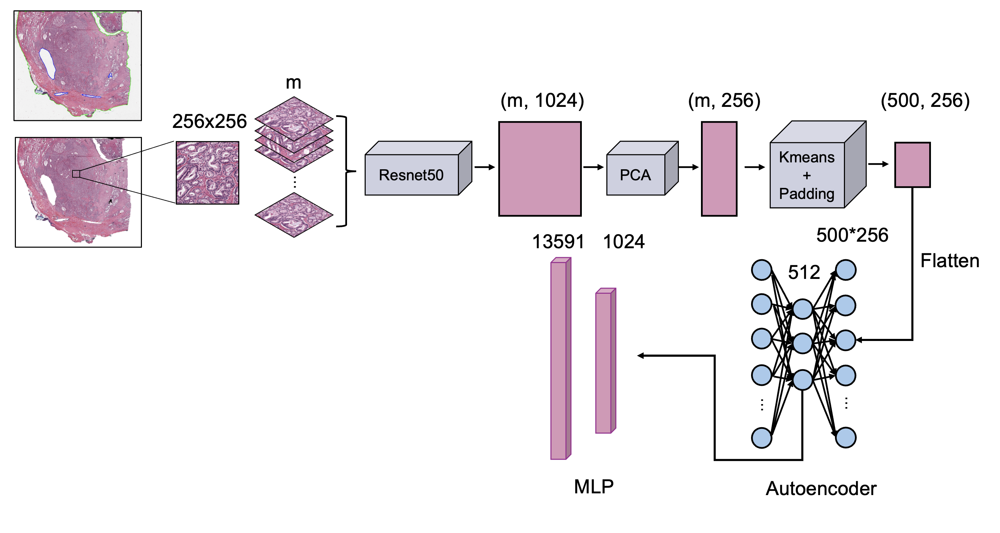

# HEpredictGENE
Using HE slide of prostate cancer to predict gene expression

1. download HE slide from TCGA and RNAseq(log2(FPKM+1)) from XENA
2. create_patches_fp.py
3. extract_features_fp.py
4. features_pac.py
5. features_kmeans.py
6. feature_padding.py
7. dataset.py
8. five_fold.py
9. evaluation.py
10. model.py
11. train.py
